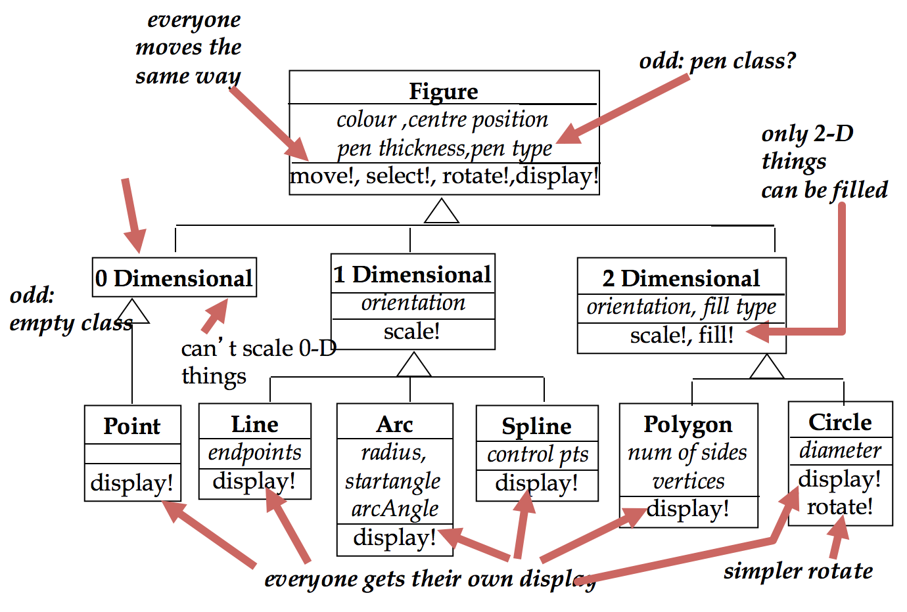
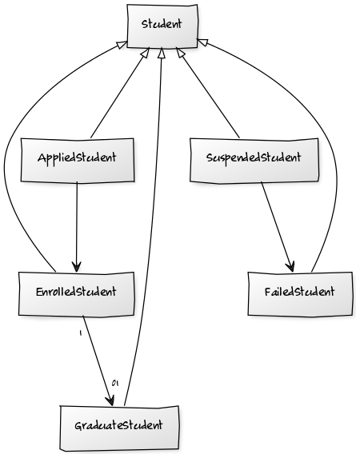
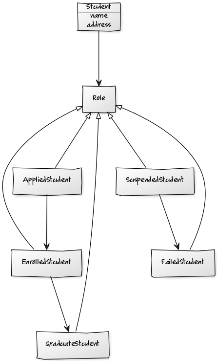

# Todo
tropos slides to class

add more columns to rubric

+ Individually, each group member:
    + take one project and check it out and try to build their web page
    + Proposes some change to the project 
    that doubles or halves the scope
    + List technical options, with some potentional pros and
    cons for each
    + Suggests any freely available tools that handle, say,
      the first half of the implementation (thus bootstrapping
   the students further into the project.)
+ As a group, meet to fill in the rubric for each of your
  three projects
+ Write a very small report that
   + Comments on the scope (effort) of the project compared
     across your own proposed scope and that of the 3 projects
     you are reviewing.
  

# Modelling

Soon or later, there will be a whiteboard or a piece of paper and someone will ask "how does it work?" and you will grab a pen/marker and start to draw.

What will you draw?

## Some history
 
Early scienctific  notations of natural processes

+ Explosed all the details of those processes
+ e.g. detailed flow charts of 
      [biochemical pathways](http://www.cc.gatech.edu/~turk/bio_sim/articles/metabolic_pathways.png)

So the software industry followed suite and produced _brittle_ diagrams
  where any change in the earlier part of the processing cascaded and meant updating the rest of the diagram. E.g. top-down structure chart:

This grew to be a huge problem, given the pace of change in
the computer industry.

+ Entire ools, consultancies, much time devoted to drawing
  and drawing pretty little diagrams.
+ Sigh.

And then, in 1972, [David Parnas](https://www.google.com/url?sa=t&rct=j&q=&esrc=s&source=web&cd=1&cad=rja&uact=8&ved=0CCAQFjAA&url=https%3A%2F%2Fwww.cs.umd.edu%2Fclass%2Fspring2003%2Fcmsc838p%2FDesign%2Fcriteria.pdf&ei=icy6VNnrNq_IsQTkx4HgDg&usg=AFQjCNHu8GZOjZDIJUxRDZIp2bHOFV-aWw&sig2=cv3hwluIXdo8vmAmkzaPLw&bvm=bv.83829542,d.cWc "On the Criteria To Be Used in Decomposing Systems
into Modules”, Comm. ACM 15, 12 (Dec. 1972), 1053-1058") had an new idea:

+ Core insight:
    + When you describe something, do so in such a 
      way that the internals of "it" can change...
    + But the description still holds valid
+ Example:
    + Parnas' offers two designs for the same thing:
        + One focusing of the detailed processing;
        + One expressing the different parts of the system as abstract services
             + Parnas likes this second way
+ Information hiding: 
    + Name the modules
    + Name the module interfaces
    + Code the internal details
+ Key benefit:
    + Maintainability
    + Leaves choices open within each module
    + Lead to the interesting in commercial OO languages 
+ Drawbacks:
  + Ineffeciencies
     + But as computers got faster, not so much
  + No global view, fewer provable properties
     + Information hiding is the anathema to 
       algorithm researchers.
     
 
## UML (unified modeling language)

Q: Why is it called _unified_?

+ A: cause in the before time, 3 object-oriented design gurus (Rumbaugh, Jacobsen, Booch) battled it out for the heats and minds and cheque books of the modern designer.
+ Then one company (Rational) just paid the trio _a lot of money_ to sit in a room and bash out a combined form.

S## Parts of UML

Divides into _what_ and _when_.

### Modeling "What" in UML

_Rectangles are classes_:

+ classes = factories (design time concept)
+ classes make instances (runtime concept)
+ Class can be divided into _name_, _attrubutes, _operations_:

_Lines_:

+ _isa_ a.k.a. inheritance, has a triangle
   + e.g. subclassing in Python
+ _uses_  a.k.a. association, a straightline
   + e.g. a class with an instance variable that points to another instance
+ _has_ : denoted by a black
  diamond
     + e.g. Person contains a date
     + If Person dies, that date dies too.
    
If you are arguing _uses_ vs _has_ then you are arguing at the wrong level.

Multiplicity:

+ Added to _uses_ and _has_
+ Counts how many at one end point to the other

e.g. (no inheritrance)

In the above _Enrolment_ is a little tricky: its a class whose instances only exist if a
_Section_ is connection to a _Student_ (if you know your ER diagrams, it is
a _bridge relation_)

Another example (all inheritance):

### Modeling "When"

#### State transistion diagrams:

Often, too low-level, too hard to maintain for fast moving domains. But detailed enough for auto-code generation:

States may be nested:

Often, states transistion diagarms are scoped
to be just the internals of a class.

#### Use case Diagrams

If state transistion diagrams are for the very small, use case diagrams are for the very big

Big chunky high leverl user-views of what big functionality the user expects of the system:

In the above:

+ ovals are "use cases" that might contains thousands
  of classes
     + and the same class might appear in many
       use case
+  _extend_ means it might optionall happen as well. 
+ _include_ means something always happens as
  part of something else
+ Shows who accesses what services
    + But not exaclty when they do it  
  
#### Sequence diagrams

Something between use cases (that are big) and state transition charts (that are small). One column per instance.

#### Activity Diagrams

Sequence diagrams show specific interaction between instances.
Activity diagrams are a little loser. Bubbles can be large scale things. 

Actvity diagrams good for large scale doodling.

## Assessment of UML

Says the advocates:
   
+ A way for teams to communicate
+ A natural way to extend OO concepts into all aspects of system design.
   
Says the oppoents:
   
+ The "undefined modeling language".
+ An international standard in drawing silly diagrams.
+ UML is evil when you use it too much for your given project; 
    + All too  easy to burn hours and hours 
      drawing pretty pictures
      when you could be writing code or tests or
      doing something more useful. 
+ Large survey on industrial usage of UML:
    + [Marian Petre, ICSE'13]()http://www.pragmadev.com/downloads/UmlInPractice.pdf)
    + Conclusions: UML not the _lingua franca of software engineering_ (used far less than thepress would suggest).
+ Classes are too small to support Parnas'
     information hiding
  + Most classes have 20 methods or less
  + Most methods are 4 lines of code or less
      + But there are some occasional monsters,
          large hunks of complex glue.
  + This is why many programming languages
        support _packages_ that can hold many
        _classes_.
+ Recent work on 
     [aspect oriented programming](http://aosd.net/)
     focuses on _cross-cutting concerns_:
   + A spiderweb that connects classes
          in different hierarchies.
   + So, guess what? Once you _divide_
     the world into lottsa little boxes...
       + You still need some way to
         wire it all together.
         
In any case, debating pros, cons, UML beside the point  

+ The "best" modeling language is the one that
     lets someone else glance at your design and say...
   1. Yes, yes I see what you are coming from
   2. Hmm... that bit, over there,  seems funny... 
+ And if that is UML, then so be it

But don't sell me your modeling notation,

+ Unless you also sell me your rules for
      critiquing designs written in that notation.

## Critiquing  a Model (Heuristic)

Here are some rules of thumbs I use with OO design. 

Note that these rules are not absolute. But when
experienced designs debate alternatives, it is
polite to collect a set of standard issues that
others know about you.

### Rule0: Class names are usually singluar 

Exception: containers.

### Rule1: If an Object Changes Class, You've Got the Wrong Classes

Odd:

Better: fix the properties that do not change in _Student_ and
make the rest _Role_s that can change.

Advantage: if there are different methods for different roles,
they can be stored seperately.

### Rule2: Things need Managers

If there are many instances of Class Thing,
  there may need to be a Things to manage Thing 

+ Management often includes _crud_ (create, read, update.
find, delete).     

### Rule3: 3-tiered Architecture

A common layered architecture is _data:model:dialog_ that takes care to sepeate "it" from
 how "it" is displayed and stored on disk. So question any design that:
 
+  Lacks a persistency layer (no read/write to disk, network, whatever).
+ Lacks a dialog layer (no user-level control of the contents). 

So the following design is... odd. Dialog not
seperated from model.

Why be strict on dialog seperation? Welcome to 
[card-based interfaces](http://blog.intercom.io/why-cards-are-the-future-of-the-web),
where every smart phone App becomes a server to an upper layer of "cards".

### Rule4: DRY (do not repeat yourself)

If you need to 
use the same knowledge it two places, do not
repeat that knowledge

+ e.g. the _EmployeeEd_ and the _Employee_ both
  might need to know that (e.g.) age runs zero to 120.
+ So define a helper system that stores constraints
  and configure _Employee_ and _EmployeeEd_ from
  the constraints.

